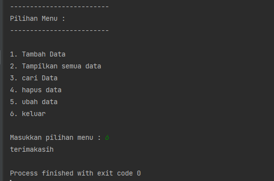

# UAS_semester1

* Nama  	: Kholid Wahyudi
* Kelas	    : TI.22.B2
* NIM		: 312210345

## link youtube
[your link here](https://youtu.be/mDSSR2Nynuw)

## Ketentuan program


## penjelasan program
program kali ini kita membuat menu inputan mahasiswa dengan menggunakan package sesuai dengan ketentuan diatas.

## daftar_nilai.py
* Pertama saya membuat file daftar_nilai.py yang terletak pada folder model dan berisi beberapa fungsi yaitu tambah_data, ubah_data, hapus_data, dan cari_data dan berisi database berupa dictionary
Berikut Code Program ```daftar_nilai.py``` :

```Python
database = {}

def tambah_data(nama,nim,tugas,uts,uas,akhir):
    database[nama] = nama, nim, tugas, uts, uas, akhir

def cari_data():
    from view.view_nilai import cari
    cari(input("\nMasukan Nama Yang Ingin dicari = "))

def hapus_data(nama):
    if nama in database.keys():
        del database[nama]
        return True
    else:
        print(f'Data Dengan Nama {nama} Tidak Ditemukan!')
        return False

def ubah_data(nama):
    if nama in database.keys():
        del database[nama]
```
## input_nilai.py
* Selanjutnya saya membuat fungsi untuk meminta user memasukan data / input yang berada pada file input_nilai.py yang berada pada modul view dan input user di gabung dengan fungsi yang sudah saya buat sebelumnya pada daftar_nilai.py untuk memasukan inputan user ke database(dictionary)
Brikut Code Program ```input_nilai.py``` :

```Python
from model.daftar_nilai import tambah_data, hapus_data, ubah_data


def masukan_data():

    print("|=========================|")
    print("|Silahkan masukkan data : |")
    print("|=========================|")

    nama = input("Masukan Nama = ")
    nim = int(input("Masukan NIM = "))
    tugas = int(input("Masukan Nilai Tugas = "))
    uts = int(input("Masukan Nilai UTS = "))
    uas = int(input("Masukan Nilai UAS = "))
    akhir = float((0.30 * tugas) + (0.35 * uts) + (0.35 * uas))
    tambah_data(nama,nim,tugas,uts,uas,akhir)

def hapus():
    hapus_data(input("Masukan Nama yang ingin di Hapus = "))

def ubah():
    ubah_data(input("Masukan Nama dari Data yang ingin di Ubah = "))
    print("\n:=====================:")
    print(":  Masukan Data Baru  :")
    print(":=====================:")

    nama = input("\nMasukan Nama = ")
    nim = int(input("Masukan NIM = "))
    tugas = int(input("Masukan Nilai Tugas = "))
    uts = int(input("Masukan Nilai UTS = "))
    uas = int(input("Masukan Nilai UAS = "))
    akhir = float((0.30 * tugas) + (0.35 * uts) + (0.35 * uas))
    tambah_data(nama, nim, tugas, uts, uas, akhir)
```
## view_nilai.py
* Selanjutnya saya membuat fungsi untuk menampilkan semua data yang ada dan fungsi untuk menampilkan hasil pencarian user dengan menggunakan modul tabulate data untuk mempercantik tabel dan memanggil database(dictionary) yang ada pada modul ```daftar_nilai.py```
Berikut code program ```view_nilai.py``` :

```Python
from model.daftar_nilai import database
from tabulate import tabulate

def tampilkan():
    print(tabulate(database.values(), headers=["Nama", "NIM", "Tugas", "UTS", "UAS", "AKHIR"], tablefmt="double_grid"))

def cari(nama):
    Data_cari = {}
    for key, value in database.items():
        if nama in value:
            Data_cari[key] = value

    print(tabulate(Data_cari.values(), headers=[
          "Nama", "NIM", "Tugas", "UTS", "UAS", "AKHIR"], tablefmt="double_grid"))
```

## main.py
* Terakhir saya membuat file main.py yang berisi code program untuk menyatukan semua fungsi yang ada di beberapa modul yang telah saya buat sebelumnya dengan mengimport modul dan fungsi yang akan saya pakai ke dalam main.py dan saya membuat perulanagn menggunakan ```py while True```  untuk membuat perulangan pada pilihan menu yang akan tampil sebagai pilihan user.
Berikut Code program ```main.py``` :

```Python
from view.input_nilai import masukan_data, hapus, ubah
from view.view_nilai import tampilkan
from model.daftar_nilai import cari_data

while True :
    print("-------------------------")
    print("Pilihan Menu : ")
    print("-------------------------")
    print()
    print("1. Tambah Data")
    print("2. Tampilkan semua data")
    print("3. cari Data")
    print("4. hapus data")
    print("5. ubah data")
    print("6. keluar")
    print()

    pilihan = input("Masukkan pilihan menu : ")

    if pilihan == '1':
        masukan_data()

    elif pilihan == '2':
        tampilkan()

    elif pilihan == '3':
        cari_data()

    elif pilihan == '4':
        hapus()

    elif pilihan == '5':
        ubah()

    elif pilihan == '6':
        print("terimakasih")
        break
    else :
        print("silahkan masukkan pilihan yang benar!!!")
```
## Hasil Program
### Tambah Data
* Berikut dokumentasi untuk hasil program pada menu `tambah data`


### Tampilkan Semua Data
Berikut dokumentasi untuk hasil program `tampilkan semua data`

### Cari Data
Berikut dokumentasi untuk hasil program `cari data`

### Hapus Data
Berikut dokumentasi untuk hasil program `hapus data`

### Ubah Data
Berikut dokumentasi untuk hasil program `ubah data`

.png)
### keluar


### Terimakasih